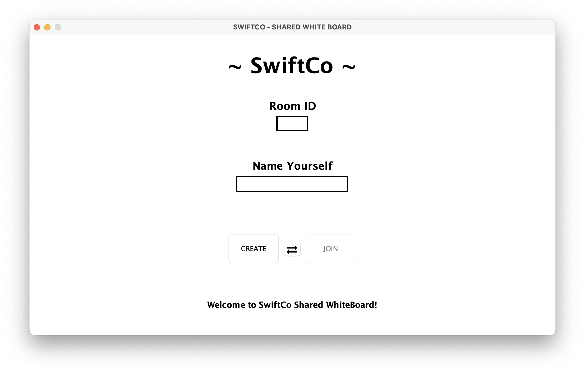
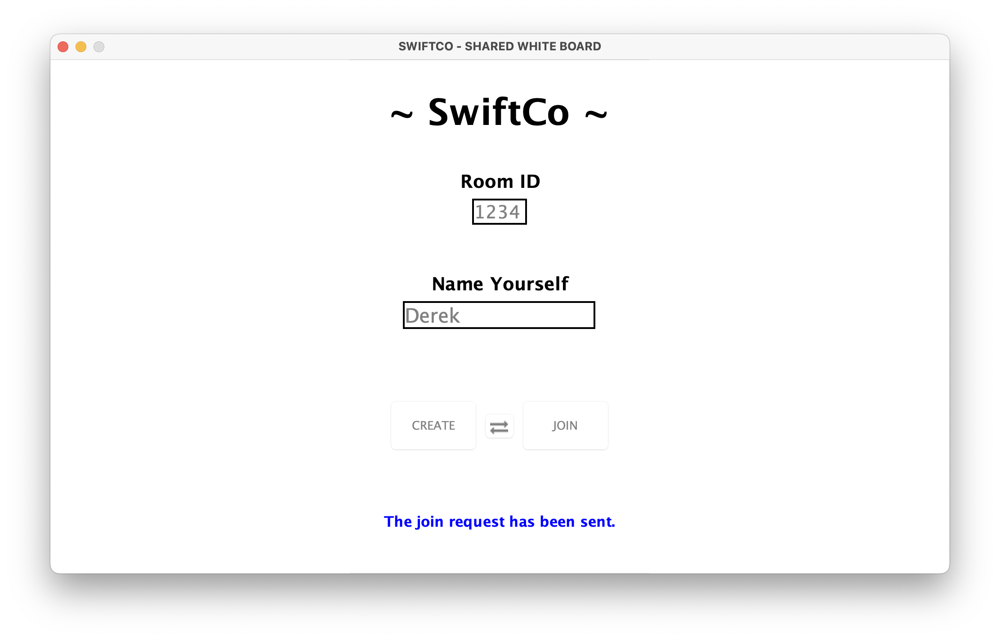
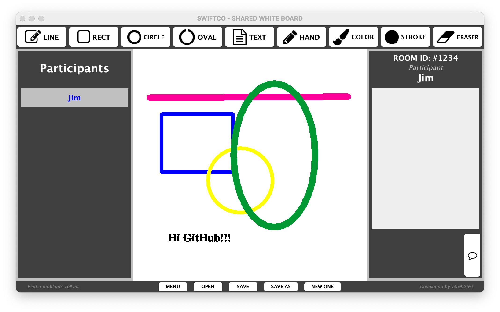
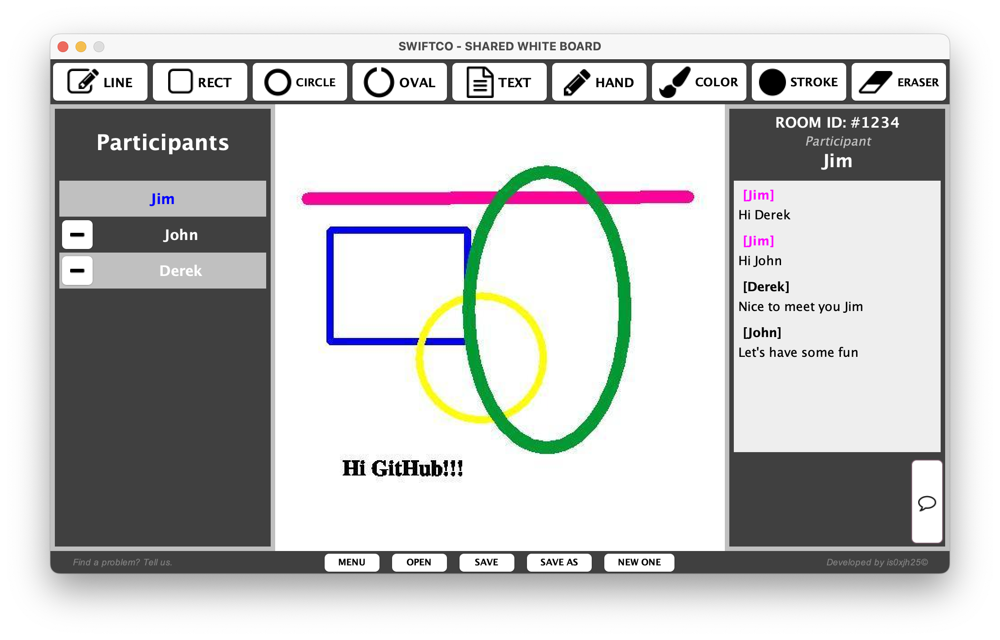
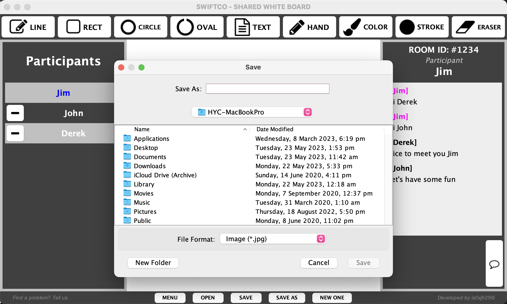
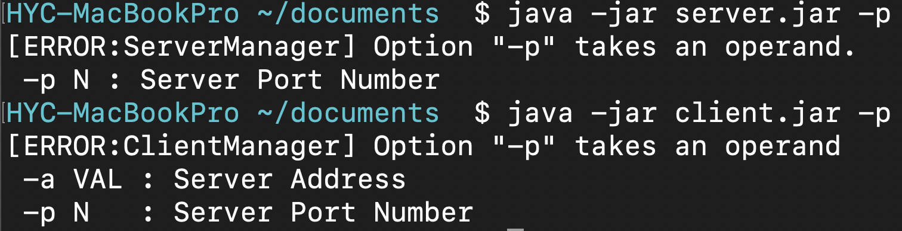

# is0xSwiftCo
 
## Table of Contents
* [About the Application](#about-the-application)
* [Getting Started](#getting-started)
* [System Design](#system-design)
* [Basic Features](#basic-features)
* [Advanced Features](#advanced-features)
* [New Innovations](#new-innovations)
* [Demo](#demo)
* [Developed By](#developed-by)

## About the Application
_is0xSwiftCo_ is a painting application which allows multiple users to draw simultaneously on a canvas over the network. The system is implemented by Java, and it is using TCP and JSON as the tools for transporting message between server and client. The architecture of the application is structured by client-server model and the server applies multithreading technology to handle the requests from clients. 

## Getting Started
- Get the jar files:
> In teriminal (package directory): `jar cf ${name for the created jar} *` 

- Start up the server:
 >In terminal: `java -jar server.jar -p <server-port>` 
 
 Type the first command in the terminal (the port argument is mandatory).

- Open the graphic user interface on the client side:
 >In terminal: `java -jar client.jar -a <server-address> -p <server-port>` 
 
 Type the first command in the terminal (the address and the port argument are mandatory). 
 For connecting to the local server, typing in “localhost” would work.
 
- Note:
 
 The user needs to make sure that the server is initiated before running the client application, otherwise the pipeline would just fail to connection.
 The command lines should be executed at the same directory where the .jar file is stored.

## System Design
- **Overview** 
- **Server Side** 
- **Client Side** 
- **Socket** 
- **Graphic User Interface (GUI)** 
- **Concurrency** 
- **Critical Analysis** 

## Basic Features
- **Drawing** 
The system supports for drawing in different shapes, such as line, circle, oval and rectangle. The shapes are resizable which could be drawn of variable sizes by dragging the mouse and not of a fixed size. Moreover, the feature of handing drawing is provided which supports the users to be more creative while they are painting.

- **Text Inputting** 
The user could press the text button and select a location for the input text. A window would pop-up, then the user could type in the word and could select the font size, font type, and font family.

- **Eraser** 
In this whiteboard, the eraser function is built in as well. The implementation is utilising the hand drawing feature with white to overlay the original painting. Since the background is white, the default colour of the hand drawing is set to white. In the future version, when the functionality of painting background is introduced, the colour of the eraser could be set to be as same as the background’s colour.

- **Colour Selection** 
The applied colour pan is from _JColourChooser_ which provides a pane of controls designed to allow a user to manipulate and select a colour. The users could pick up any colour they want.

- **User List** 
Since it is a “shared” whiteboard, the user in a same room should be allowed to see each other’s username. Therefore, the user would know who are currently editing the same whiteboard. The manager would be always coloured in magenta and be on the top of list. Alternatively, the user him/herself would be highlighted by blue.

## Advanced Features
- **Chat Window** 
It allows users to communicate with each other by typing a text.

- **File Menu** 
_Connect Page_ allows the users to input the server IP and port not only using the command argument but also changing the information via the GUI. To some extents, it improves the user experience.

- **Kick Out** 
This is the manager’s privilege to remove a participant from the room. On the user list, only the manager can see the remove button beside every participant. After the manager presses the button and confirms on the confirmed dialogue, the selected user would be removed, and he/she would be notified as well. After kicking a person out, the user list would be updated immediately.

## New Innovations
- **Argument Hint** 
To start up the server, the only required argument is server port number, and server address and port are mandatory for the client side. If any one of the arguments is missing, an error message would alert the specific one and it would be printed out in the terminal.

- **Client Menu** 
It is designed for enhancing the user experience and supporting the feature of room hosting (more details in the following section). In the _Client Menu_, there are room id text field, username text field, create button and join button. All the textboxes and buttons are working with input validations. For instance, “username cannot be empty” would appear if the user presses the create or join button without typing the username. In this scenario, the request would not be sent to the server (since the error is already detected) to avoid using unnecessary resource on the server. The menu has a text field to display the message which allows the user to see the warning and notification from the system.

- **Room Hosting** 
The design of _Room Hosting_ empowers the server to host several whiteboards at the same time on the same address and same port. Every room id should be four digits and it should be identical when it is created. The username would be enforced unique in a single room. The taken room id and taken username would be handled by the validation from the server.

- **Stroke and Font Selection** 
To enrich the drawing feature, _Stroke Selection_ and _Font Selection_ are introduced. _Stroke Selection_ is for any type of drawing and eraser. _Font Selection_ is for _Text Inputting_.

- **Save Before Leave** 
_Save Before Leave_ is a functionality designed for the manager of the room. Since the manager can have a new canvas and close a canvas, the application would like to ensure that the manager has considered if the created canvas wants to be saved. There is a pop-up dialogue to warn the manager if the canvas is unsaved when the manager is leaving, or the app is closing.

- **Feedback Support** 
There is a reporting button on the footer which can email to is0.jimhsiao@gmail.com and the user can attach the error message, so there is less bug in the next version of _is0xSwiftCo_.

## Demo
- **Menu**

  

- **Menu Hint**

  

- **Whiteboard**

  

- **Co Whiteboard**

  

- **Save Canvas**

  

- **Argument Hint**

  

## Developed By
- The application is developed by _[is0xjh25 (Yun-Chi Hsiao)](https://is0xjh25.github.io)_ 
 

  
